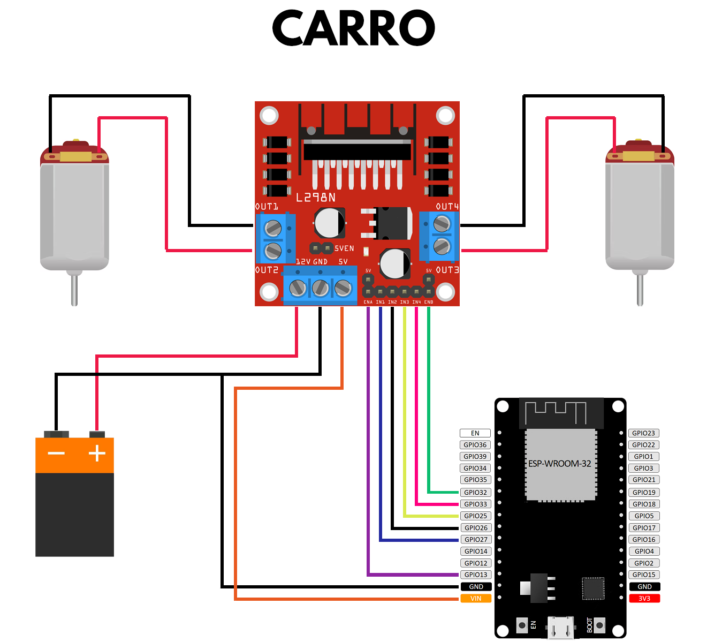
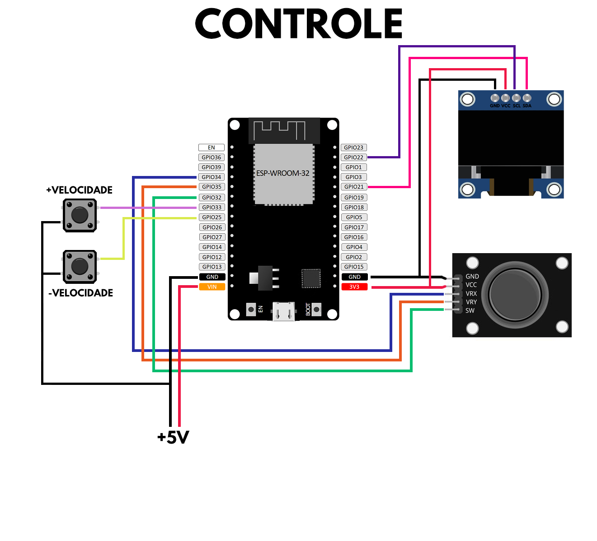
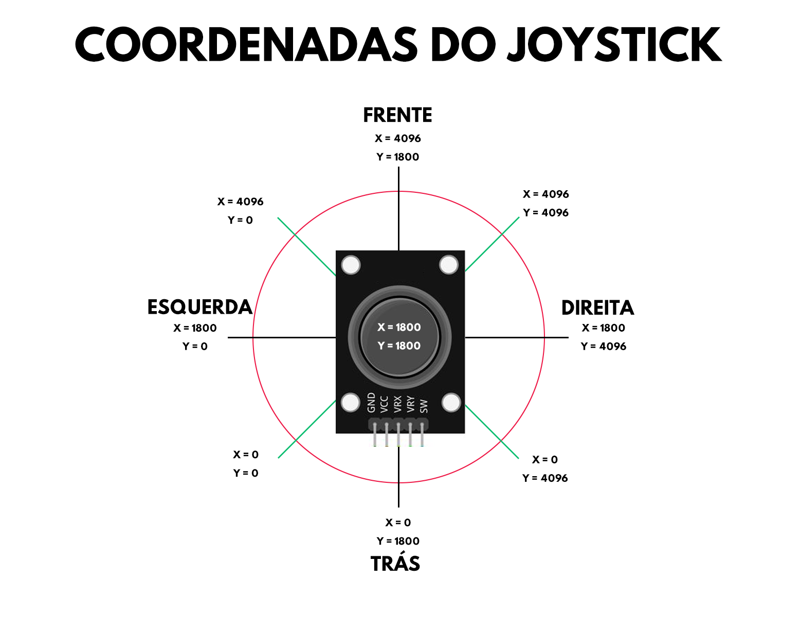

- O código foi testado com a versão 3.2.0 da biblioteca do ESP32.
- Certifique-se de substituir o endereço MAC no código pelos do seu transmissor e receptor.

## Lista de partes no protótipo

- 1x Kit Chassi 2WD
- 2x ESP32-WROOM-32D
- 1x Módulo Driver Ponte H - L298N
- 3x Bateria 18650
- 2x Módulo Joystick Analógico de 3 Eixos
- 3x Chave Táteis (push buttons)
- 1x Display OLED SSD1306 0.96″ 128×64 (indicador do nível de velocidade)
- 1x LED 3mm verde
- 1x LED 3mm vermelho
- 1x resistor 100Ω 1/4W
- 1x resistor 150Ω 1/4W
  
## Diagramas

    

    

    

