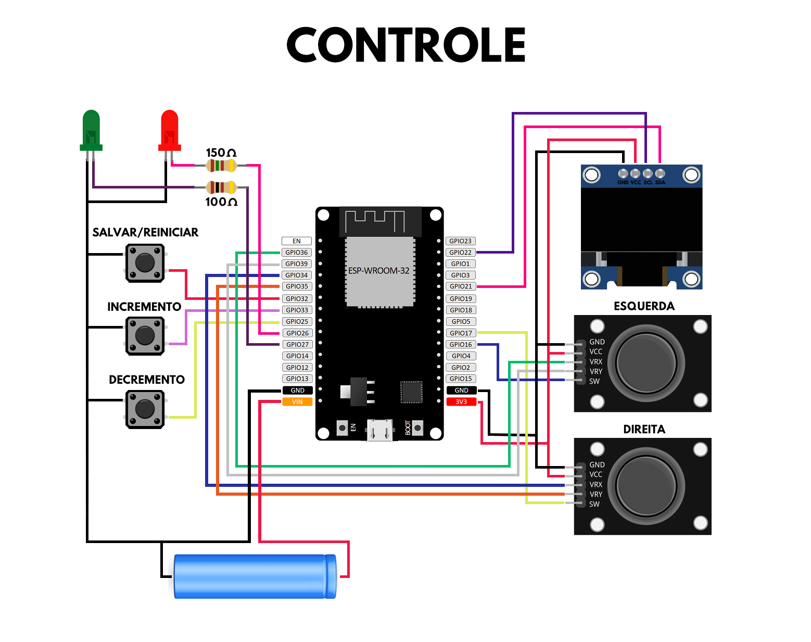

- O código foi testado com a versão 3.1.1 da biblioteca do ESP32.
- Certifique-se de substituir o endereço MAC no código pelos do seu transmissor e receptor.

## Lista de partes

- 1x Kit Chassi 2WD
- 2x ESP32-WROOM-32D
- 1x Módulo Driver Ponte H - L298N
- 2x Power Banks (ou módulos de baterias) para o carro e controle
- 2x Módulo Joystick Analógico de 3 Eixos
- 2x Chave Táteis (push buttons)
- 1x Display OLED SSD1306 0.96″ 128×64

## Diagramas

    

    

    

