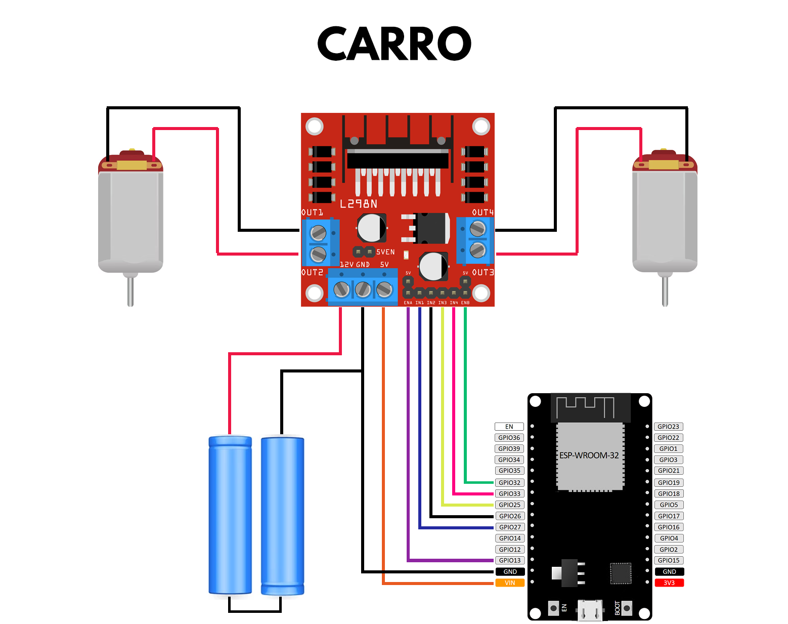

- O código foi testado com a versão 3.1.1 da biblioteca do ESP32
- Certifique-se de substituir o endereço MAC no código pelos do seu transmissor e receptor.

## Lista de partes

- 2x ESP32-WROOM-32D
- 1x Kit Chassi 2WD
- 1x Módulo Joystick Analógico de 3 Eixos
- 1x Módulo Driver Ponte H - L298N
- 2x Power Banks (ou módulos de baterias)
- 2x Chave Táteis (push buttons)

## Diagramas

    

    

